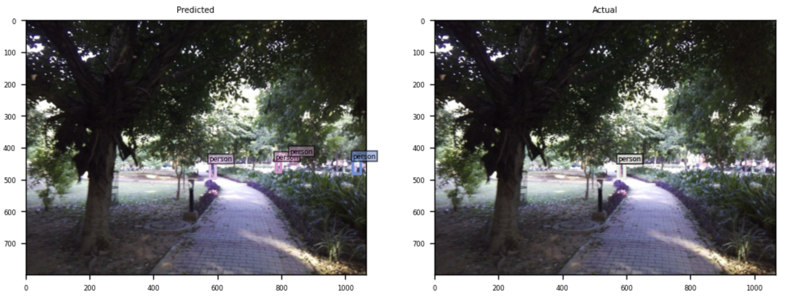
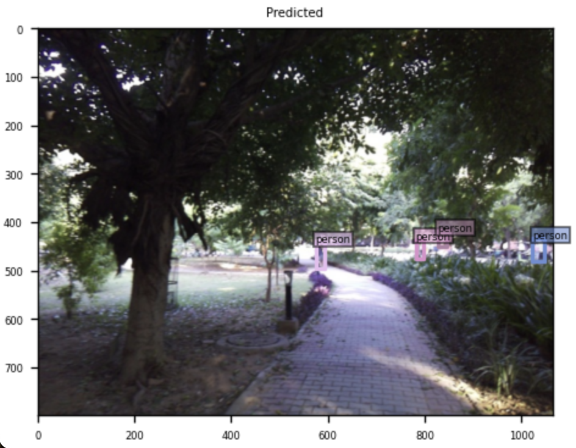
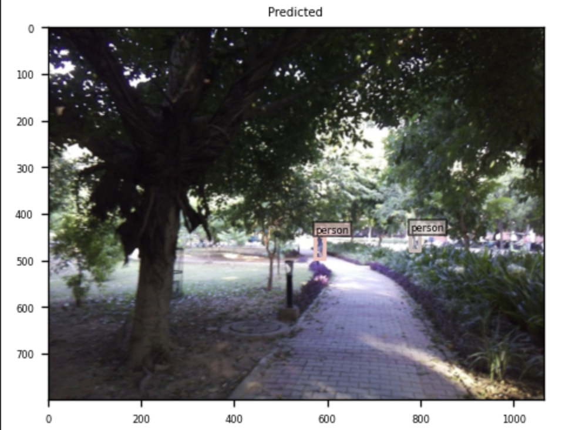

# Vision Lab October 2024 CV Researcher Assignment Submission
This project is a submission for the Vision Lab October 2024 computer vision researcher assignment. It demonstrates the fine-tuning and evaluation of a pre-trained DINO model with a ResNet-50 backbone, specifically tailored for detecting the "person" class in a provided dataset. The repository includes a Jupyter notebook which simplifies the demonstration of the process, allowing for clear, step-by-step execution of the code. The notebook format was chosen to facilitate ease of understanding and interaction with the model's functionality. To maximize efficiency and reduce setup time, the code within the notebook follows minimal coding standards, focusing on straightforward implementation rather than complex coding practices. This approach ensures quick modifications and testing, ideal for research and development scenarios where time is a critical factor.

## Dataset Preparation
The dataset was obtained from [the link provided for this task](https://drive.google.com/drive/folders/1DCpmo919b7OrAng9clEbiMHjO3D0hyoa?usp=sharing), which contains both image data and their annotations in a JSON file. The data was manually split into a training set with 160 images and a validation set with 40 images. All data were organized according to the COCO dataset format for compatibility with the model.

## Repository Setup
The project uses the DINO repository, cloned from the provided [link](https://github.com/IDEA-Research/DINO/tree/main). Initial setup challenges included compatibility issues with Python and library versions. The project specifically tested under older versions of Python (3.7) and PyTorch (1.9.0), which conflicted with newer library dependencies, and versions of dependencies are not defined in the requirements. Adjustments included downgrading Python versions and manually installing specific library versions to maintain compatibility, but face the pytorch installation issue, where i could not able to restart the kernel after installation. A local runtime with Docker on Google Colab was attempted but faced issues due to support for CUDA only and not MPS. Eventually, Google Colab's default Python version (3.10) and newer versions of PyTorch were used, requiring manual installation of dependencies of specific versions and modifications to the `pycoco` library to ensure compatibility, since i could not able to downgrade `numpy`.

## GPU Access
The project was executed using a Tesla T4 GPU on Google Colab, with no special configuration adjustments needed for the GPU. Due to limited computational resources, I limited the number of visualized images to five. Manual compilation of CUDA operators was necessary to ensure model compatibility:
```bash
%cd ./models/dino/ops
!sh ./make.sh
```

## Pre-trained Model
The DINO-4scale pre-trained model with a ResNet-50 backbone was downloaded from [here](https://drive.google.com/drive/folders/1qD5m1NmK0kjE5hh-G17XUX751WsEG-h_). The model used was trained with 11 epochs.

## Configuration Adjustments
Modifications in 'config/DINO/DINO_4scale.py' included reducing 'num_classes' and 'dn_labelbook_size' from 91 to 1 to tailor the model to the specific detection task.

## Report and Analysis
Performance metrics were documented as follows before fine-tuning:

| Metric | Value |
|--------|-------|
| AP @ IoU=0.50:0.95 | 0.494 |
| AP @ IoU=0.50      | 0.824 |
| AP @ IoU=0.75      | 0.521 |
| AP @ IoU=0.50:0.95 (small) | 0.388 |
| AP @ IoU=0.50:0.95 (medium) | 0.634 |
| AP @ IoU=0.50:0.95 (large) | 0.823 |
| AR @ IoU=0.50:0.95 (all maxDets=100) | 0.591 |
| AR @ IoU=0.50:0.95 (large maxDets=100) | 0.920 |

### Visualization
5 predictions are visualized using modified [COCOVisualizer class](https://github.com/IDEA-Research/DINO/blob/main/util/visualizer.py), this modified method helped me to visualized the images of actual and prediction side-by-side.

### Errors in the Detection
Errors and cases where the model failed to detect objects correctly were analyzed, with visualizations indicating issues such as false recognition of random spaces as the "person" class:
<div>
    
    <p><em>Figure 1: Error in detection where random spaces were misidentified as "person".</em></p>
</div>

## Fine-tuning
The model was fine-tuned without architectural modifications but with specific parameters ignored for fine-tuning as detailed in the command '--finetune_ignore label_enc.weight class_embed'. The performance metrics after fine-tuning improved significantly:

| Metric | Value |
|--------|-------|
| AP @ IoU=0.50:0.95 | 0.546 (+0.052) |
| AP @ IoU=0.50      | 0.876 (+0.052) |
| AP @ IoU=0.75      | 0.621 (+0.100) |
| AP @ IoU=0.50:0.95 (small) | 0.444 (+0.056) |
| AP @ IoU=0.50:0.95 (medium) | 0.693 (+0.059) |
| AP @ IoU=0.50:0.95 (large) | 0.868 (+0.045) |
| AR @ IoU=0.50:0.95 (all maxDets=100) | 0.673 (+0.082) |
| AR @ IoU=0.50:0.95 (large maxDets=100) | 0.920 (no change) |

Comparative visualizations of detection results before and after fine-tuning highlighted the improvements:
<div>
    
    <p><em>Figure 2: Before fine-tuning.</em></p>
</div>

<div>
    
    <p><em>Figure 3: After fine-tuning.</em></p>
</div>

## Submission Format
The project code, fine-tuned model weights, and detailed report are submitted through a GitHub repository. The model weights are also uploaded to Google Drive and linked within the README. A comprehensive report, including visualizations of detection results and loss graphs generated during fine-tuning, is included in .pdf format within the repository.
